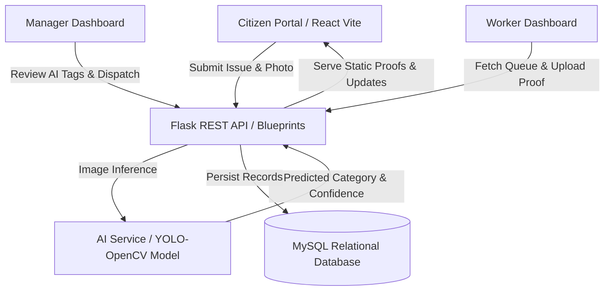

# CivicSync Implementation Plan
### Intelligent Civic Complaint Management & Automated Triage System

---

## Executive Overview
**CivicSync** is a full-stack, enterprise-grade civic complaint management platform designed to streamline urban municipal governance. Citizens submit photo-geotagged infrastructure issues (potholes, garbage overflows, malfunctioning streetlights, water pipeline bursts), an **AI Vision Classifier (YOLO/OpenCV)** automatically classifies and assesses severity, municipal managers review and dispatch field staff, and field operatives resolve tickets by submitting verifiable proof-of-work photographs.

---

## Architecture Overview



---

## Development Phases Breakdown

### Phase 1: Database Architecture & Relational Modeling (`database/`)
- **Objective:** Establish an ACID-compliant relational MySQL database structure supporting multi-role access and audit timelines.
- **Key Deliverables:**
  - `database/schema.sql`: Full DDL script with constraints and indexes.
  - Tables:
    1. `departments`: Municipal departments (Roads, Sanitation, Electrical, Water, Parks).
    2. `users`: Citizen, Manager, Worker, Admin authentication and roles.
    3. `workers`: Worker profile, department assignment, badge number, and real-time status.
    4. `complaints`: Core ticket lifecycle (`pending` → `verified` → `assigned` → `in_progress` → `resolved` → `rejected`).
    5. `complaint_logs`: Complete audit history of AI classification, manager overrides, and worker progress.
    6. `feedback`: Post-resolution citizen satisfaction ratings (1-5 stars) and comments.
  - Performance: Composite indexes on `(status, category)` and `(assigned_worker_id, status)`.

### Phase 2: Python (Flask) Backend & ORM Service (`backend/`)
- **Objective:** Implement modular Flask REST application factory with blueprints and SQLAlchemy ORM.
- **Key Deliverables:**
  - `backend/config.py`: Environment-driven configuration (MySQL via PyMySQL with connection pooling).
  - `backend/models.py`: SQLAlchemy declarative ORM models with `to_dict()` JSON serialization and password hashing.
  - `backend/app.py`: Blueprint architecture:
    - `/api/complaints`: Citizen complaint creation, retrieval, and milestone tracking.
    - `/api/manager`: Manager overview, category overrides, and staff assignment.
    - `/api/worker`: Field staff task lists and proof-of-work uploads.
    - `/api/ai`: Direct vision inference and classification diagnostics.
    - `/api/health`: Automated health check and subsystem status.
  - Secure multipart file handling with unique UUID prefixes.

### Phase 3: AI Vision Classifier & Automated Triage Engine (`ai_service/`)
- **Objective:** Build real-time image classification and object detection pipeline.
- **Key Deliverables:**
  - `ai_service/model.py`: `CivicVisionClassifier` class.
  - Supported Categories:
    - `pothole` (Roads & Infrastructure)
    - `garbage_dump` (Sanitation & Waste)
    - `street_light` (Electrical & Lighting)
    - `water_leakage` (Water Supply & Drainage)
    - `fallen_tree` (Parks & Horticulture)
    - `broken_sidewalk` (Roads & Infrastructure)
  - Preprocessing & inference pipeline with fallback heuristic mode when GPU/OpenCV weights are uninitialized.
  - Severity estimation algorithm factoring confidence levels and detection counts.
  - `ai_service/weights/`: Model checkpoints repository for YOLOv8 weights.

### Phase 4: React (Vite) Modern Frontend Portals (`frontend/`)
- **Objective:** High-performance, reactive, and visually stunning web application.
- **Key Deliverables:**
  - Design System (`src/index.css`): Modern Neo-Glassmorphism, curated typography (Plus Jakarta Sans & Outfit), responsive CSS grid.
  - `src/App.jsx`: Global state coordination, notification toast engine, and tabbed dashboard switcher.
  - `src/components/CitizenDashboard.jsx`:
    - Issue submission form with photo preview.
    - AI Vision Pre-scan interactive simulation.
    - Real-time milestone tracker timeline for reported tickets.
  - `src/components/ManagerDashboard.jsx`:
    - Municipal metrics (total reports, pending triage, AI accuracy, resolved count).
    - Triage board with AI confidence meters.
    - Manual category override and worker assignment dispatches.
  - `src/components/WorkerDashboard.jsx`:
    - Field operations task queue.
    - Before & After visual comparison interface.
    - Proof-of-work image upload and field resolution notes.

### Phase 5: Integration, Verification & Deployment
- **Integration Testing:**
  - End-to-end verification: Citizen reports issue → AI classifies → Manager dispatches worker → Worker uploads proof → Issue marked resolved.
  - CORS and proxy verification via Vite proxy configuration.
- **Production Hardening:**
  - Environment variable separation (`.env`).
  - Gunicorn / UWSGI deployment for Flask.
  - Static asset compilation via `npm run build`.

---

## File Tree Reference
```
civicsync/
├── ai_service/
│   ├── model.py            # YOLO/OpenCV classification logic & fallback engine
│   └── weights/
│       └── README.md       # Weight checkpoints instructions
├── backend/
│   ├── app.py              # Flask entrypoint & modular blueprints
│   ├── config.py           # PyMySQL configuration & environment settings
│   ├── models.py           # SQLAlchemy relational models
│   └── requirements.txt    # Python dependencies
├── database/
│   └── schema.sql          # MySQL relational schema & seed data
├── frontend/
│   ├── index.html          # HTML entry point with fonts & metadata
│   ├── package.json        # Node.js project & script configuration
│   ├── vite.config.js      # Vite dev server & backend API proxy
│   └── src/
│       ├── App.jsx         # Main tabbed navigation & shared state
│       ├── index.css       # Neo-Glassmorphism design tokens & styles
│       ├── main.jsx        # React root mounter
│       └── components/
│           ├── CitizenDashboard.jsx
│           ├── ManagerDashboard.jsx
│           └── WorkerDashboard.jsx
├── .env.example            # Environment variables template
├── implementation_plan.md  # Development phases and architecture document
└── README.md               # Quickstart and usage manual
```
